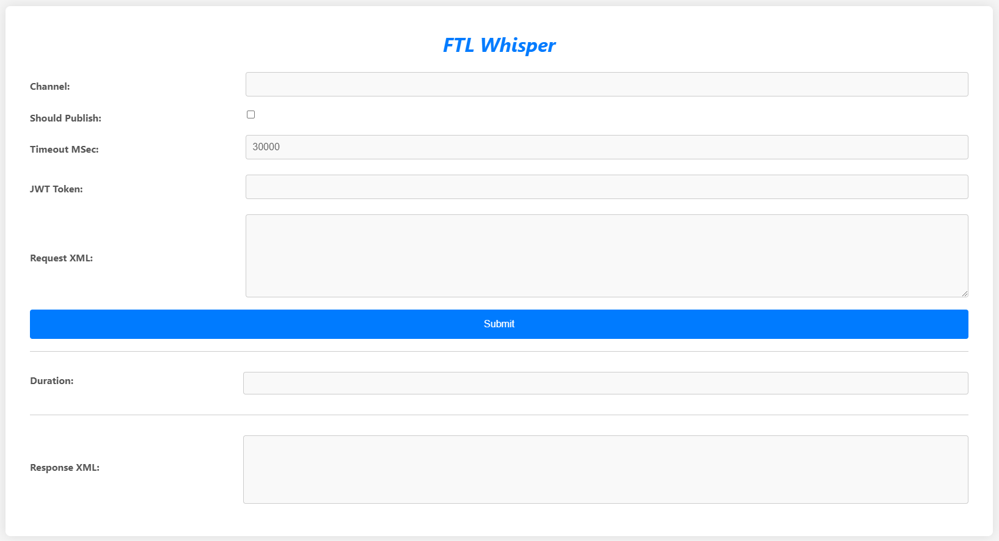

# FTL Whisper

FTL Whisper is a simple web application designed to facilitate communication through FTL channels. It supports two communication methods: publishing messages and subscribing to channels to receive messages.

## Features

- **Publish:** Users can publish messages to FTL channels.
- **Subscribe:** Users can subscribe to FTL channels to receive messages.
- **Modern UI:** The application features a modern user interface for ease of use.

## Usage

1. **Publish Messages:**
    - Enter the channel name in the "Channel" input field.
    - Check the "Should Publish" checkbox to indicate that the message should be published.
    - Enter the timeout in milliseconds in the "Timeout MSec" input field.
    - Enter the JWT token in the "JWT Token" input field.
    - Enter the request XML in the "Request XML" textarea.
    - Click the "Submit" button to publish the message.

2. **Subscribe to Channels:**
    - Enter the channel name in the "Channel" input field.
    - Leave the "Should Publish" checkbox unchecked to indicate subscribing to the channel.
    - Enter the timeout in milliseconds in the "Timeout MSec" input field.
    - Enter the JWT token in the "JWT Token" input field.
    - Enter the request XML in the "Request XML" textarea.
    - Click the "Submit" button to subscribe to the channel.

## Installation

1. Repository:

   **BusinessWorks/Applications/FTLWhisper/src**

3. Open the http://localhost:port in your web browser.
    

## Benefits

1. **Simplified Communication:** FTL Whisper provides a straightforward interface for both publishing messages and subscribing to channels, making communication tasks easier and more accessible.

2. **Testing Capabilities:** Developers can leverage FTL Whisper to publish messages for testing purposes, facilitating the validation of messaging functionalities within their applications.

3. **Orchestration Testing:** FTL Whisper allows for testing of individual orchestrations rather than the complete flow, enabling developers to isolate and validate specific components or functionalities within their systems.

